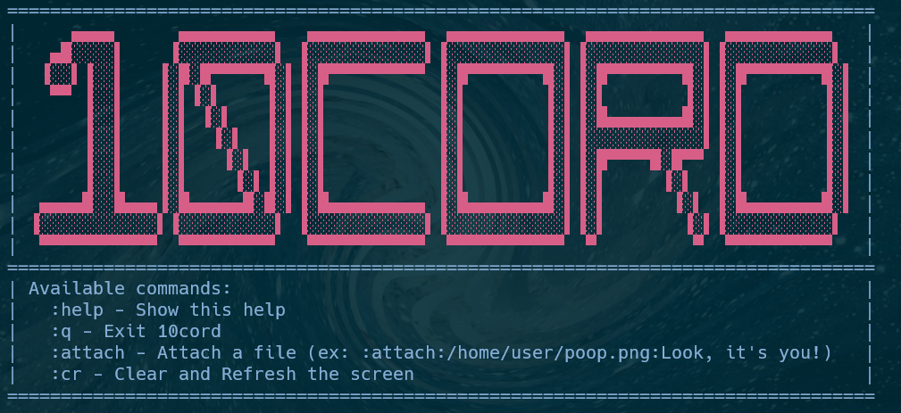
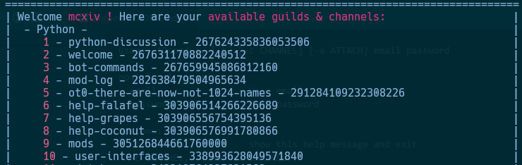
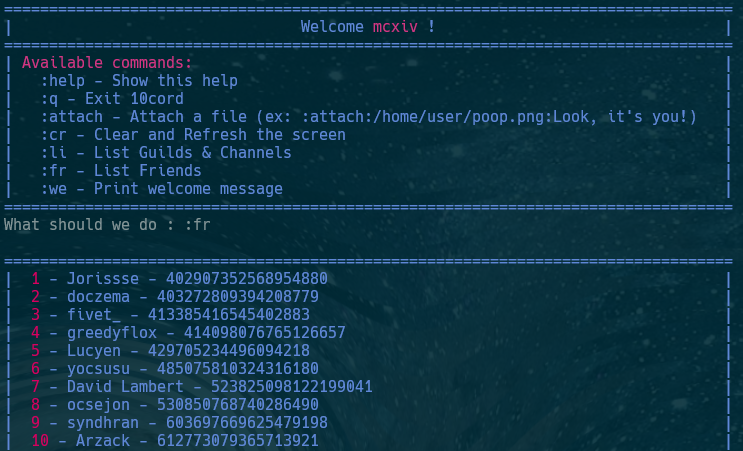

# 10cord
**10cord** is a **Discord alternative client** as a **Command Line Interface (CLI) application**.
Yes, it might be **against Discord's TOS**, but it is a fun project to work on. It is written in Python, and only uses HTTP requests to communicate with Discord's API.

By using **10cord**, you can safely talk with your friends on Discord in your company's open space, without having to worry about your boss seeing that you're not working. You will just look like a hacker, and that's cool. (If you disable images and videos, of course)

## Installation
```bash
git clone https://github.com/MCXIV/10cord.git
cd 10cord
python3 -m pip install .
```

### Optional
If you want to display images and videos in your terminal, you can install [chafa](https://github.com/hpjansson/chafa) (Linux only)

**Be careful, 10cord automatically downloads any attachments if you enabled them.**

```bash
# Arch Linux
yay -S chafa
sudo pacman -S chafa

# Debian
sudo apt install chafa
```

## Usage
```
10cord -h

usage: 10cord.py [-h] [-c CHANNEL] [-a ATTACH] email password

positional arguments:
  email                 User email
  password              User password

options:
  -h, --help            show this help message and exit
  -c CHANNEL, --channel CHANNEL
                        Channel ID to get messages from
  -a ATTACH, --attach ATTACH
                        If true, displays attachments (Requires chafa)

10cord $EMAIL $PASSWORD
```

### Selecting a channel
When you launch 10cord, and type `:li` or `:fr`, a list of all your guilds and channels or friends will be displayed. You can select a channel by typing its ID and pressing enter.

**Be careful, the ID to input is the `local channel ID`, which is to the left of the channel name.**

You can also use the `-c` option to select a channel automatically (By using the Discord's ID). See [Usage](#usage).

#### Guilds & channels



#### Friends



*The name `friends` is misleading. This is actually people you DMed.*

### Sending messages
To send a message, just type it and press enter.

### Sending attachments
To send an attachment, type `:attach:<path>:<content>` and press enter. `<path>` is the path to the file, and `<content>` is the message to send with the attachment. If `<content>` is empty, the attachment will be sent without any message.

### Internal commands
- `:q` to quit the application
- `:attach:<path>:<content>` to send an attachment.
- `:cr` to refresh the screen
- `:help` to display the help message
- `:li` to list all guilds and channels
- `:fr` to list all friends
- `:we` to print the welcome message again

## Demo


## Contributing
Pull requests are welcome. For major changes, please open an issue first to discuss what you would like to change. (:
