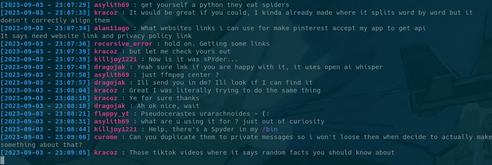

# 10cord
**10cord** is a **Discord alternative client** as a **Command Line Interface (CLI) application**. Yes, it is **against Discord's TOS**, but it is a fun project to work on. It is written in Python, and only uses HTTP requests to communicate with Discord's API.

By using **10cord**, you can safely talk with your friends on Discord in your company's open space, without having to worry about your boss seeing that you're not working. You will just look like a hacker, and that's cool.

## Installation
```bash
git clone https://github.com/MCXIV/10cord.git
cd 10cord
python3 -m pip install -r requirements.txt
```

## Usage
```bash
python3 src/10cord.py -h                                 
usage: 10cord.py [-h] email password channel

positional arguments:
  email       User email
  password    User password
  channel     Channel ID to get messages from

options:
  -h, --help  show this help message and exit


python3 src/10cord.py $EMAIL $PASSWORD $CHANNEL
```

## Output example


## Features
- login
- get messages from a specific channel
- send messages to a specific channel (just type your message and press enter)